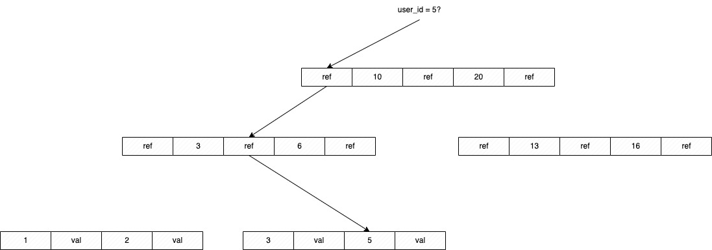

# Chapter 3: Storage and Retrieval

This chapter will basically explain how data can be stored and retrieved in different types of databases.

Imagine the simplest example: a text file, which can be structured as lines of key/value pairs separated by commas.

```
12345,The number of the beast
42,The answer to life and everything
```

If we are to insert new values, it would have a pretty good performance. All we need to do is **append** a new line to the file. 

However, if we want to retrieve a value, we would need to read the whole file and search for the key. This is not very efficient,
having a cost of O(n).

If we want to make the retrieve operation efficient, we need another separate structure: an _index_. The idea is to keep additional
metadata derived from the file, which will help us find the value we are looking for. This structure is updated every time we insert
a new value in our file.

The most important tradeoff here is that: **adding an index makes writes slower, but makes reads faster**.

## Hash indexes

In the same example, let's say our index is a hash table, which maps from keys to byte offsets in the file. The hash table is kept in
memory, so it is small enough to be read quickly.

When we want to retrieve a value, we first look up the key in the hash table, which gives us the byte offset in the file. Then we can seek
to that position in the file and read the value.
```
12345,The number of the beast\n42,The answer to life and everything
```

| Key   | Byte offset |
|-------|-------------|
| 12345 | 0           |
| 42    | 31          |

### Segmentation and compaction

The problem with this approach is that the file will grow over time, and the hash table will no longer fit in memory. One solution is to
split the file into segments of a certain size, and have a separate hash table for each segment. This is called **segmentation**.

When we are writing to our file, we append the new key/value pair to the end of the file. If the segment is full, we can throw away
the old values of each key, keep only the most recent value and write them into a new segment. This is called **compaction**.

Imagine a file that appends key-values of views per cat videos. We have a segment that was compacted into a new segment.

|           |           |           |          |           |          |
|-----------|-----------|-----------|----------|-----------|----------|
| mew:1078  | purr:2103 | purr:2104 | mew:1079 | mew:1080  | mew:1081 |
| purr:2105 | purr:2106 | purr:2107 | yawn:511 | purr:2108 | mew:1082 |

↓↓ Compaction process ↓↓

|          |           |          |
|----------|-----------|----------|
| mew:1082 | purr:2108 | yawn:511 |

Each segment has its own hash table, so if we look for a key, we will first try to find it in the most recent segment's hash table. If we
don't find it, we will look in the previous segment's hash table, and so on.

### SSTables and LSM-Trees

An SSTable has the same mechanism we described, but it is a file that is sorted by key. This makes it easier to search for a key using
binary search. The advantages are:
- To create a new segment from others, it uses an approach similar to the merge sort algorithm.
- There is no need to keep all the hash tables in memory, since we can find the range using the existing keys and scan from a sparse index.
- Each entry of the sparse index can point to a compressed block in the disk.

A sorted _memtable_ can be used to keep the most recent writes in memory as a red-black or AVL tree, and when it is full, it is written to 
disk as an SSTable. This is called **log-structured merge-tree (LSM-tree)**.

## B-Trees

B-Trees are a more general data structure than LSM-trees. They are used in databases like PostgreSQL and Oracle. They are optimized for
systems that read and write data in blocks, and they are designed to work well even if the data is too large to fit in memory.

The only similarity with LSM-trees is that they also keep key-value pairs sorted by key.

Each page is a block of bytes (usually 4kB), which can be identified using an address, which allows one page to refer to another.
One page is called the root page, when a request arrives, the root page is read and a binary search is performed to find the key.
If it's not found, the page will contain a pointer to another page, which will be read and searched, and so on, until it finds
a page that contains values for the searched key, which is called a **leaf page**.



When adding a new key-value pair, the algorithm needs to check if the leaf page is full. If it is, it will split the page in two
and move half of the key-value pairs to a new page. The parent page will then be updated to add a pointer to the new page.

The algorithm ensures that the tree is balanced, so the height of the tree is O(log n), where n is the number of key-value pairs.

B-trees also have a mechanism to prevent the index to be corrupted if the database crashes during a write operation. It is called
**write-ahead log (WAL)**. It is a file that records all the changes that are being made to the database. When a write operation
is performed, it is first written to the log, and only then it is written to the B-tree. If the database crashes, it can recover
the B-tree by replaying the log from the last checkpoint.

## B-Trees vs LSM-Trees

### Advantages of LSM-Trees
- In general more suited for write-heavy workloads since it is append-only.
- Produce less write amplification (less data is written to disk).
- Can be compressed more efficiently, producing smaller files on disk.

### Advantages of B-Trees
- In general have better read performance.
- No need to periodically merge segments, which may interfere with ongoing writes and reads.
- Less space overhead (no need to keep a sparse index).
- Strong transactional guarantees since data exists in only one place, so it's easy to use locks.