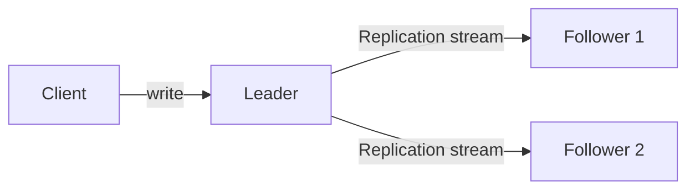
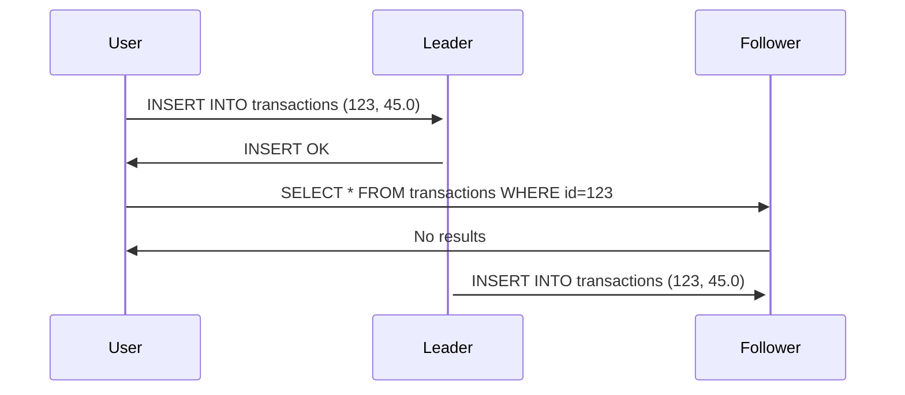

# Chapter 5 - Replication

Replication means keeping a copy of some data in a different machine, so that if one machine fails, the data can still 
be served from the remaining one. Also it's useful for scaling reads and keep data geo-distributed.

## Leaders and Followers

This is one of the most common ways to replicate data. The idea is to have one machine acting as the leader. It
receives write operations, write it locally and send the data to the followers with a replication log. The followers
then apply the log locally.

If a client wants to read data, they can go either to the leader or to any follower.

### Synchronous vs Asynchronous Replication

A write operation can be replicated synchronously or asynchronously.
- **Synchronous**: the leader waits until the follower confirms that it received the write before reporting success 
to the client.
- **Asynchronous**: the leader sends the write to the follower and reports success to the client without waiting for
the follower to confirm.

It's usually impractical to make all followers synchronous, since it would make the write operation too slow and any
outage would make the leader unavailable. So what is usually done is to make one follower synchronous and the others
asynchronous.

### Setting up new followers

When a new follower is added, it needs to copy the data from the leader. This is usually done by:
1. Taking a consistent snapshot of the leader's database.
2. Copying the snapshot to the new follower.
3. The follower connects to the leader and get the replication log since the snapshot was taken.
4. The follower applies the log to the snapshot.

### Handling node outages

#### Follower outage

If a follower is down, it can recover quite easily. It just needs to reconnect to the leader and get the replication
log since the last entry it received.

#### Leader outage

If the leader is down, one of the followers can be promoted to be the new leader. This is called **failover**. It can
happen manually or automatically in the following steps:
1. Detect the leader failure through a heartbeat mechanism.
2. Choose a new leader, which is usually the follower with the most up-to-date data.
3. Set clients to send writes to the new leader.

Some things can go wrong on this process:
- If the leader fails before the followers receive the write, it will be lost.
- Autoincrementing sequences can be a problem, since the new leader may assign the same sequence number to previously
generated values in the old leader. If those values were used in other systems, it can cause conflicts.
- Two nodes may believe they are the leader. Some systems shut down one of the leaders if his is detected.
- Misconfigured timeouts can cause the system to think the leader is down when it's not, making failovers to happen
unnecessarily.

### Implementation of Replication Logs

The replication log can be implemented as a sequence of operations. Let's say we are working with a MySQL database. We'd
replicate each SQL operation in the order they were received. This is called **statement-based replication**. However, 
it can lead to problems because we need to consider edge cases, such as non-deterministic functions, like `NOW()`; we 
need to handle concurrency due to changes in the same row.

Due to those problems, another approach is to replicate the changes to the database. This is called **write-ahead log
(WAL)**. This log is an append-only sequence of bytes, which contains all changes made to a database. This can be used
to build a replica on a follower.

We can decouple the replication log from the database engine internals by using a **logical log**. It is a sequence of
records representing write operation in a row-based granularity. This allows leader and follower to use different
database versions or even storage engines. We can also use it for external applications to read from, this is
called **change data capture (CDC)**.

### Replication Lag

Working with replication means that we can design a database that can scale for read operations. It's not feasible to
synchronously replicate all writes to all followers because one single partition failure would make the whole system
unavailable. So we need to make this process asynchronous, meaning that the followers will be a bit behind the leader.
This is called **replication lag**.

This can lead to situations like below:

