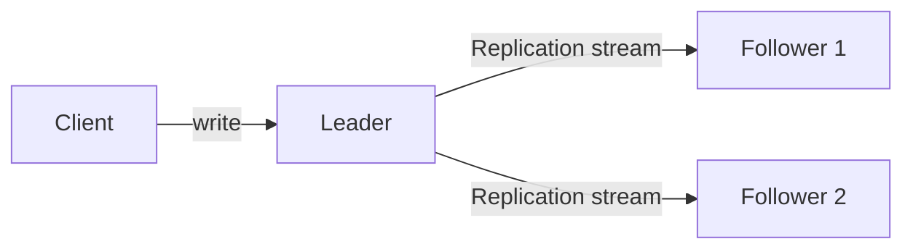
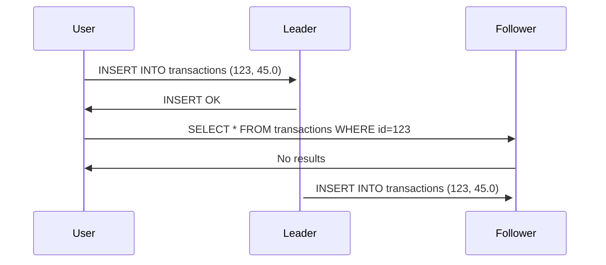
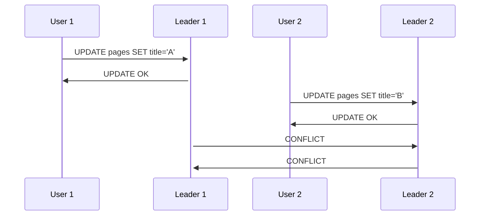
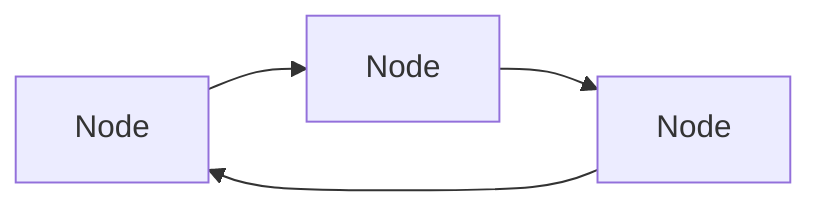
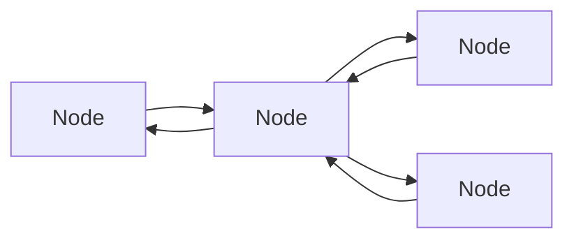
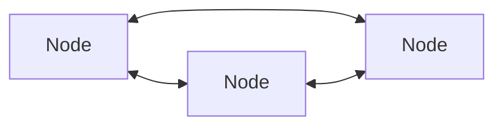
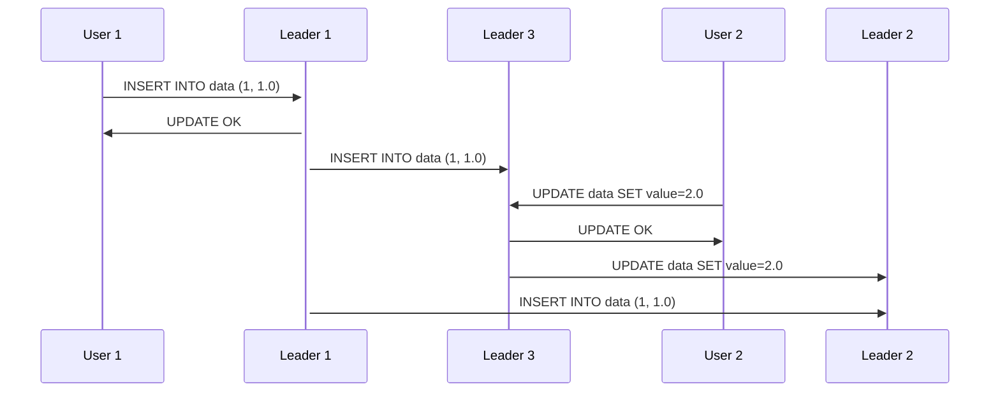

# Chapter 5 - Replication

Replication means keeping a copy of some data in a different machine, so that if one machine fails, the data can still 
be served from the remaining one. Also it's useful for scaling reads and keep data geo-distributed.

## Leaders and Followers

This is one of the most common ways to replicate data. The idea is to have one machine acting as the leader. It
receives write operations, write it locally and send the data to the followers with a replication log. The followers
then apply the log locally.

If a client wants to read data, they can go either to the leader or to any follower.



### Synchronous vs Asynchronous Replication

A write operation can be replicated synchronously or asynchronously.
- **Synchronous**: the leader waits until the follower confirms that it received the write before reporting success 
to the client.
- **Asynchronous**: the leader sends the write to the follower and reports success to the client without waiting for
the follower to confirm.

It's usually impractical to make all followers synchronous, since it would make the write operation too slow and any
outage would make the leader unavailable. So what is usually done is to make one follower synchronous and the others
asynchronous.

### Setting up new followers

When a new follower is added, it needs to copy the data from the leader. This is usually done by:
1. Taking a consistent snapshot of the leader's database.
2. Copying the snapshot to the new follower.
3. The follower connects to the leader and get the replication log since the snapshot was taken.
4. The follower applies the log to the snapshot.

### Handling node outages

#### Follower outage

If a follower is down, it can recover quite easily. It just needs to reconnect to the leader and get the replication
log since the last entry it received.

#### Leader outage

If the leader is down, one of the followers can be promoted to be the new leader. This is called **failover**. It can
happen manually or automatically in the following steps:
1. Detect the leader failure through a heartbeat mechanism.
2. Choose a new leader, which is usually the follower with the most up-to-date data.
3. Set clients to send writes to the new leader.

Some things can go wrong on this process:
- If the leader fails before the followers receive the write, it will be lost.
- Autoincrementing sequences can be a problem, since the new leader may assign the same sequence number to previously
generated values in the old leader. If those values were used in other systems, it can cause conflicts.
- Two nodes may believe they are the leader. Some systems shut down one of the leaders if his is detected.
- Misconfigured timeouts can cause the system to think the leader is down when it's not, making failovers to happen
unnecessarily.

### Implementation of Replication Logs

The replication log can be implemented as a sequence of operations. Let's say we are working with a MySQL database. We'd
replicate each SQL operation in the order they were received. This is called **statement-based replication**. However, 
it can lead to problems because we need to consider edge cases, such as non-deterministic functions, like `NOW()`; we 
need to handle concurrency due to changes in the same row.

Due to those problems, another approach is to replicate the changes to the database. This is called **write-ahead log
(WAL)**. This log is an append-only sequence of bytes, which contains all changes made to a database. This can be used
to build a replica on a follower.

We can decouple the replication log from the database engine internals by using a **logical log**. It is a sequence of
records representing write operation in a row-based granularity. This allows leader and follower to use different
database versions or even storage engines. We can also use it for external applications to read from, this is
called **change data capture (CDC)**.

### Replication Lag

Working with replication means that we can design a database that can scale for read operations. It's not feasible to
synchronously replicate all writes to all followers because one single partition failure would make the whole system
unavailable. So we need to make this process asynchronous, meaning that the followers will be a bit behind the leader.
This is called **replication lag**.

This can lead to situations like below:



In order for this to be avoided, we need to make sure that the follower is up-to-date before reading from it. We have 
some alternatives to do it, such as:
- When reading something that the user has modified, read it from the leader.
- Track the last update time and, for some time, read from the leader.
- Track the update time for each row and when reading from the replica, check if the row is up-to-date.

These are workarounds and can be hard to implement, being prone to inconsistencies and bugs.

#### Monotonic Reads

In the same scenario as above, imagine we have two followers. A user can read from one of them and then from the other.
It can happen that in the first read, user got the most recent value, but in the second one they may get an older value.
A guarantee that avoids this anomaly is called **monotonic reads**. It's stronger than eventual consistency, but weaker
than strong consistency.

### Solutions for Replication Lag

In order to avoid issues as mentioned above, databases can provide some sort of guarantees. _Transactions_ were created
to provide stronger guarantees, although they are not enough to solve all problems. At some level, eventual consistency
is needed when we are working in a distributed system.

## Multi-Leader Replication

So far we saw how single-leader replication works. If we want to have the cabaibility of writing to any node, we need
to use multi-leader replication. This is useful for a multi-datacenter operation: if we have a datacenter in Europe and 
another in the US, we can have a leader in each datacenter, so that users can write to the closest one.

The biggest challenge of multi-leader replication is handling conflicts that happen when two nodes receive writes at
the same time.

Other use-cases for this kind of replications are mobile applications that operate off-line and collaborative editing.

### Handling Write Conflicts

Imagine a scenario where two users try to update the title of the same page. We can end-up in a situation like this:



In principle, this could be avoided by synchronously replicating writes between leaders. However, this would make the
system to lose the main advantages of multi-leader replication. So we need to find a way to handle conflicts.

The first approach is to simply avoid the conflict. This can be achieved if we can guarantee that requests will always
go to the same leader based on some property. For example, every request for updating user data goes to the same leader.

Given that we can't always avoid conflicts, and also that there is no "correct" write values that happened in a conflict,
we need to converge to a final value. This can be done in some ways:
- **Last write wins (LWW)**: the last write to be received is the one that wins. This is usually implemented by attaching
a timestamp to each write and choosing the one with the most recent timestamp.
- **Merge values**: if the data type allows it, we can merge the values. For example, the merged title would be "A/B".
- **Record conflicts**: record conflicts in a structure and handle it through application code.

### Replication Topologies

Various different topologies are possible for multi-leader replication. Some of them are:

Circular



Star



All to all



One of the issues with circular and star topologies is that if one node fails, the whole system can become unavailable.

All-to-all topologies are more resilient to failures, but they can also present problems. Imagine two users are updating
a key, it could happen that the key ends up having different values in different replicas:



In this scenario, leader 2 will be inconsistent because it received the replication from leader 1 after the one from
leader 3.

## Writing to the DB when a node is down

In a typical quorum system, we need the majority of nodes to acknowledge a write before reporting success to the client.
It can happen that one of the replicas is down, so a write is considered successful even though it was not replicated
to all nodes.

If this node comes back, it might have a different value for some keys. If a client requests the value for them, it
might get stale values. To avoid this, read requests can be sent to all nodes in parallel and the most recent value 
can be returned.

In order to repair the stale values, we can use:
- **Read repair**: when a client reads a stale value, it can write it back to the database with a newer timestamp.
- **Anti-entropy process**: a background process that compares data between two replicas and copies the most recent
value to the other replica.

## Quorum Consistency

Quorums can be defined when reading and/or writing data. It`s the minimum number of replicas that need to be available
in order to perform the operation.

If we have 3 nodes and a quorum of 2 for both writes and reads, it means that we can expect to get the most recent
value when reading, because if one node is down, the write will fail on it, but when reading, we are sure that at least
one of the nodes that received the write will have the value.

```
w + r > n
```

Typically, we can make n an odd number and set w and r to be (n+1)/2. This way, we can tolerate up to (n-1)/2 failures.

In practice, some edge cases can happen:
- Two writes can happen at the same time without clear winner.
- A write and a read can happen at the same time, where the read gets the value before the write.
- If a write failed in more than w and not rolled back, it can be read by a client.
- A node fail and gets restored with a replica that is not up-to-date.