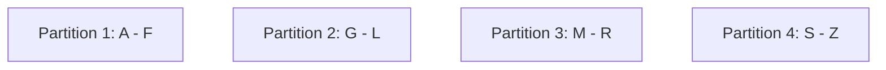
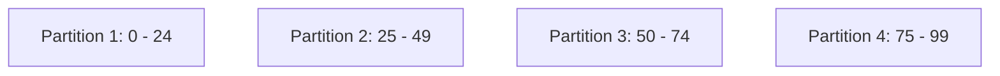
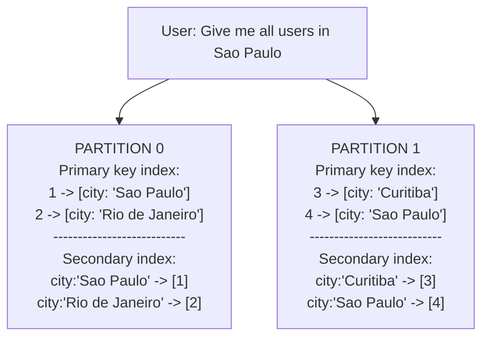
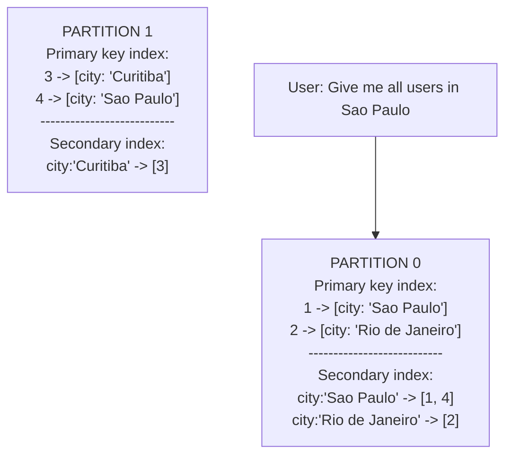
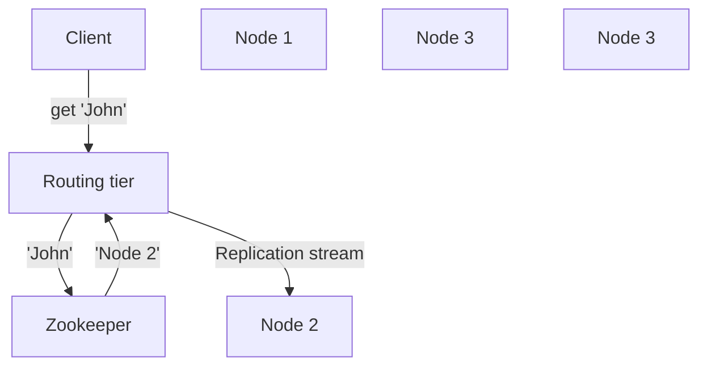

# Chapter 6 - Partitioning

Partitioning means splitting a database into multiple parts called partitions. Each partition is located on a different
machine. Queries and writes can be routed to the correct partition based on the value of a key, which makes scalability
easier.

Partitioning is usually combined with replication, so that copies of each partition are stored on several machines.

## Partitioning of Key-Value Data

Our goal is to split the data evenly across partitions, so that all partitions have roughly the same size. If this 
doesn't happen, we call it **skewed**. A partition with a lot more data than the others is called a **hot spot**.

One way to partition is to assign range of keys to each partition. For example, for an encyclopedia, we could assign
ranges of letters to each partition. This is called **range partitioning**.

The downside of this approach is that it can lead to hot spots. In our example, if we have a lot of articles starting
with the letter A, the partition that stores the A range will be a hot spot.

Due to this risk, range partitioning is not used very often. Instead, we can use **hash partitioning**. We take a
hash of the key and use the result to determine which partition the key belongs to.

We then distribute the ranges of hashes evenly across partitions. For example, if we have a hash function that returns
an integer between 0 and 99, we can assign the following ranges to each partition:

By applying the hash function to the key, which could be a timestamp, we can determine which partition the key belongs,
such as:
- 2024-01-01 00:00:00 -> 25 -> Partition 2
- 2024-01-01 00:00:01 -> 62 -> Partition 3
- 2024-01-01 00:00:02 -> 2 -> Partition 1
- 2024-01-01 00:00:03 -> 99 -> Partition 4

Although it avoids hot spots, it has a downside: it's not possible to efficiently query a range of keys. Also, if we
always insert the same key, it will always go to the same partition, which will eventually become a hot spot, making
the data skewed.

### Skewed workloads

Even with a hash function, it's possible to have skewed workloads. Imagine a scenario of a social network, where the key
is the user ID. Depending on the interactions a very famous user has, the partition that stores them will become a hot
spot. This is called a **skewed workload**.

## Partitioning and Secondary Indexes

Sometimes, it's not enough to have only one key, because we might want to query our data in a different way. For example,
find all users that live in a certain city, or all cars with a certain color. In order to achieve that, we need to
use a **secondary index**. These also need to be partitioned, and there are two ways to do it.

### Partitioning secondary indexes by document

In this approach, the secondary index is partitioned in the same way as the primary key, i.e., the secondary index will
be stored in the same partition as the document it refers to.

The advantage of this is that, when writing, we only need to write to one partition. However, when reading, we need to
query all partitions and merge the results. This is called a **scatter/gather** approach.

### Partitioning secondary indexes by term

In this approach, the secondary index in independent of the primary key, since it's partitioned by the term itself, or
using a hash of the term.

The main advantage of this approach is that we don't need to query all partitions if we are looking for a specific term.
However, when writing, it becomes more expensive, since we might need to write to multiple partitions. Also, updates to
these secondary indexes are asynchronous.

## Rebalancing partitions

When we add a new partition, we need to move some data from the existing partitions to the new one. This is called
**rebalancing**.

### Strategies for Rebalancing

#### Fixed number of partitions

The simplest approach is to assign many more partitions than the number of machines we have. For example, a database
with 10 nodes may be split into 100 partitions.

When a new node is added to the cluster, it can steal a few partitions from an existing nodes. If a node is removed,
its partitions can be distributed to the remaining ones.

The advantage of this approach is that we don't need to move a lot of data when a new node is added.

The number of partitions we configure will be the maximum number of nodes we can have in the cluster.

Keeping a lot of partitions is expensive, so we need to find a balance in this number, and it's usually not trivial.
The correct number of partitions is "just right". Neither too big, nor too small.

#### Dynamic partitioning

Some key-range partitioning schemes usually create partitions dynamically. When a partition grows above a specific
size (example: 10GB), it's split into two partitions. At the same time, if a lot of data is deleted from a partition,
and it falls below a certain size, it can be merged with another partition, similarly to what happens in a B-Tree.

The main advantage of this is that the number of partitions will adapt according to the data size. However, a caveat
is that we'd start with just one partition, so if we have multiple nodes, only one of them will be used. To mitigate
this, we can start with a fixed number of partitions.

#### Partitioning proportionally to nodes

In this approach, the number of partitions is proportional to the number of nodes. For example, if we have 4 nodes, we
can have 12 partitions. This way, each  node  will have 3 partitions.

We'll aim to always have this proportion, otherwise we can create hot spots. For example, if we add a new node  to the
cluster, we'll end up with 5 nodes and 12 partitions, which means that one node will have 4 partitions, while the others
will have 3. This is not ideal, so we need to rebalance the partitions. We can do this by splitting the partitions that
have more data, or by merging the ones that have less data. In the example, we could end up with 15 partitions.

## Request Routing

When a client wants to read or write data, it needs to know which partition to contact. There are some approaches for
that:
- Client can contact any node, if that node contains the data, it will serve the request. Otherwise, it will forward
the request to the correct node.
- Client can contact a routing tier first, which will tell the client which node to contact.

Some systems use a coordinator service, such as ZooKeeper, to keep track of which nodes are in the cluster. Other actors
can query ZooKeeper to find out which node to contact for a given key.

(Sorry about the diagram, I can't figure out how to make it look better)

Some databases, such as Cassandra, use a gossip protocol to keep track of the changes in the cluster. Requests can be 
sent to any node, which will forward the request to the correct node. This adds more complexity to the system, but it
makes it more resilient to failures, because it doesn't have a single point of failure, such as ZooKeeper.