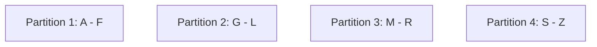
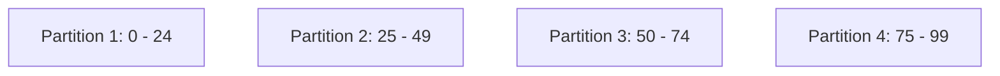
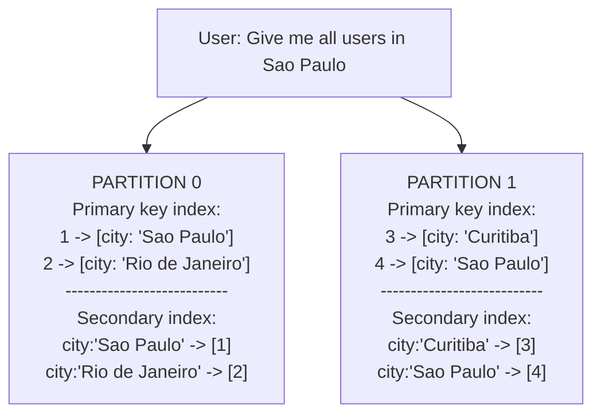

# Chapter 6 - Partitioning

Partitioning means splitting a database into multiple parts called partitions. Each partition is located on a different
machine. Queries and writes can be routed to the correct partition based on the value of a key, which makes scalability
easier.

Partitioning is usually combined with replication, so that copies of each partition are stored on several machines.

## Partitioning of Key-Value Data

Our goal is to split the data evenly across partitions, so that all partitions have roughly the same size. If this 
doesn't happen, we call it **skewed**. A partition with a lot more data than the others is called a **hot spot**.

One way to partition is to assign range of keys to each partition. For example, for an encyclopedia, we could assign
ranges of letters to each partition. This is called **range partitioning**.



The downside of this approach is that it can lead to hot spots. In our example, if we have a lot of articles starting
with the letter A, the partition that stores the A range will be a hot spot.

Due to this risk, range partitioning is not used very often. Instead, we can use **hash partitioning**. We take a
hash of the key and use the result to determine which partition the key belongs to.

We then distribute the ranges of hashes evenly across partitions. For example, if we have a hash function that returns
an integer between 0 and 99, we can assign the following ranges to each partition:



By applying the hash function to the key, which could be a timestamp, we can determine which partition the key belongs,
such as:
- 2024-01-01 00:00:00 -> 25 -> Partition 2
- 2024-01-01 00:00:01 -> 62 -> Partition 3
- 2024-01-01 00:00:02 -> 2 -> Partition 1
- 2024-01-01 00:00:03 -> 99 -> Partition 4

Although it avoids hot spots, it has a downside: it's not possible to efficiently query a range of keys. Also, if we
always insert the same key, it will always go to the same partition, which will eventually become a hot spot, making
the data skewed.

### Skewed workloads

Even with a hash function, it's possible to have skewed workloads. Imagine a scenario of a social network, where the key
is the user ID. Depending on the interactions a very famous user has, the partition that stores them will become a hot
spot. This is called a **skewed workload**.

## Partitioning and Secondary Indexes

Sometimes, it's not enough to have only one key, because we might want to query our data in a different way. For example,
find all users that live in a certain city, or all cars with a certain color. In order to achieve that, we need to
use a **secondary index**. These also need to be partitioned, and there are two ways to do it.

### Partitioning secondary indexes by document

In this approach, the secondary index is partitioned in the same way as the primary key, i.e., the secondary index will
be stored in the same partition as the document it refers to.



The advantage of this is that, when writing, we only need to write to one partition. However, when reading, we need to
query all partitions and merge the results. This is called a **scatter/gather** approach.

### Partitioning secondary indexes by term

In this approach, the secondary index in independent of the primary key, since it's partitioned by the term itself, or
using a hash of the term.

```mermaid
flowchart 
    A["PARTITION 0 
    Primary key index:
    1 -> [city: 'Sao Paulo']
    2 -> [city: 'Rio de Janeiro']
    ---------------------------
    Secondary index:
    city:'Sao Paulo' -> [1, 4]
    city:'Rio de Janeiro' -> [2]"]
    
    B["PARTITION 1 
    Primary key index:
    3 -> [city: 'Curitiba']
    4 -> [city: 'Sao Paulo']
    ---------------------------
    Secondary index:
    city:'Curitiba' -> [3]
    
    C[User: Give me all users in Sao Paulo] --> A
```

The main advantage of this approach is that we don't need to query all partitions if we are looking for a specific term.
However, when writing, it becomes more expensive, since we might need to write to multiple partitions. Also, updates to
these secondary indexes are asynchronous.