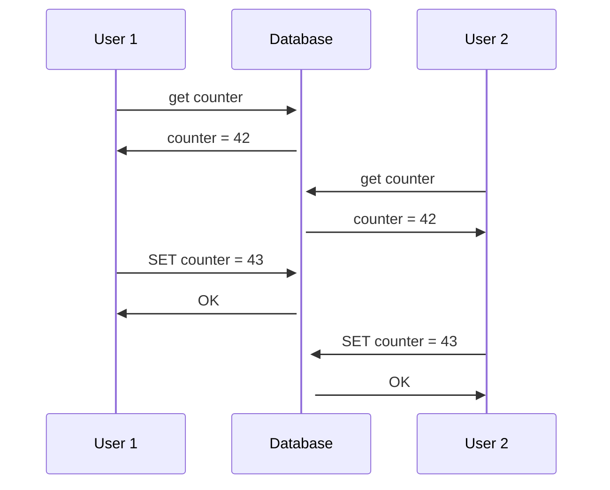

# Chapter 7 - Transactions

Conceptually, a transaction is a way for an application to group several reads and writes together into a logical unit.
Either all reads and writes in a transaction are reflected in the database, or none of them are.

By using transactions, the application can ignore certain potential errors.

With the hype of NoSQL databases, transactions are sometimes seen as the anthitesis of scalability. So some people think
that, in order to achieve scalability, we need to give up on transactions. In the other hand, some people think that
transactions are a fundamental building block of databases if you work with "serious" data.

## ACID

The safety guarantees that transactions provide are usually described by the acronym ACID: Atomicity, Consistency,
Isolation and Durability. Systems that don't provide these guarantees are sometimes called BASE (Basically Available,
Soft state, Eventual consistency).

### Atomicity

Atomic means something that cannot be broken down into smaller parts. In the context of databases, atomicity means that,
if operations are grouped together into a transaction and something goes wrong during its execution, the transaction is
**aborted** and the database state is left unchanged. When it finishes, it **commits** all the changes at once.

### Consistency

The letter C doesn't really belong to ACID. It basically guarantees that you don't violate any integrity constraints.
For example, in an accounting system, credits and debits must always be balanced, this is called an **invariant**.

The database can't really guarantee that it will always be balanced. This is the application's responsibility. The 
database will provide **atomicity** and **isolation** so that the application can achieve **consistency**.

### Isolation

Concurrently executing transactions are isolated from each other: they cannot step on each other's toes. An example
of a violation of isolation can be seen in the following scenario:

We have a race condition here. Both users read the counter, and then set it to 43. The second user overwrote the first
user's change.

A fully isolated database would be called **serializable**, which means that every transaction is executed one after
the other, as if they were running in a single thread. However, this is not practical, because it would be too slow.
So, some databases implement **snapshot isolation**. We'll talk about it later.

### Durability

It's the promise that once a transaction has been committed, it will remain so. Typically, it means that the data 
will be written to a non-volatile storage. It usually considers the write-ahead log or something similar. Also, in 
replicated databases, it means that the data has been successfully copied to some number of nodes.