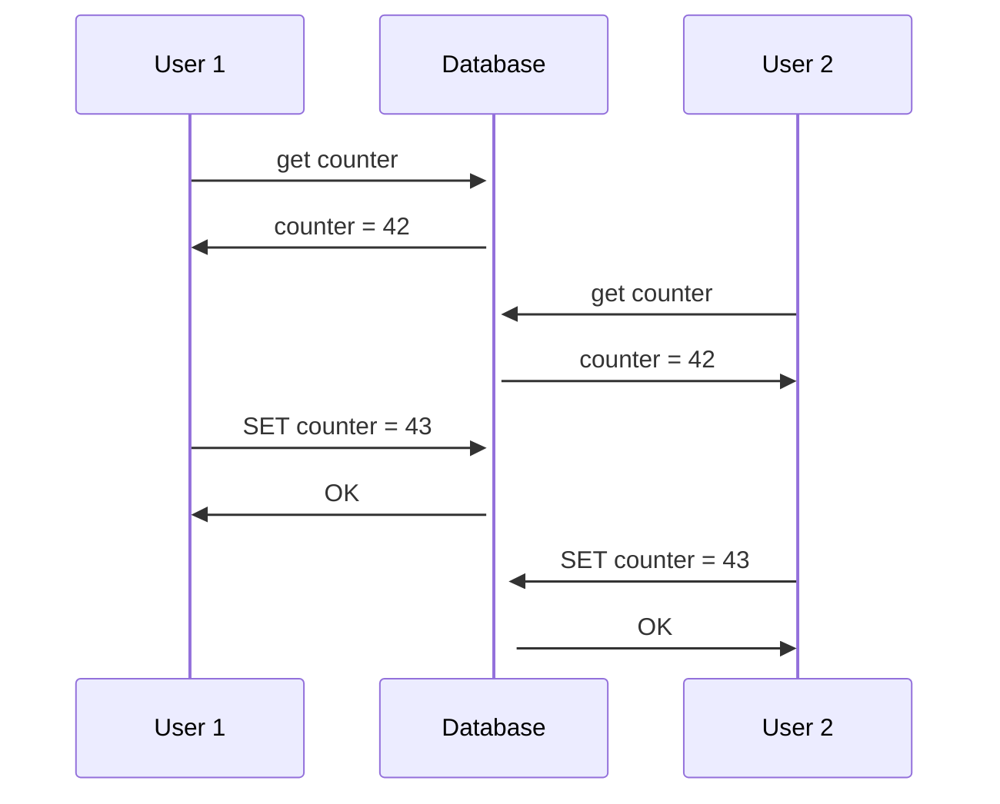
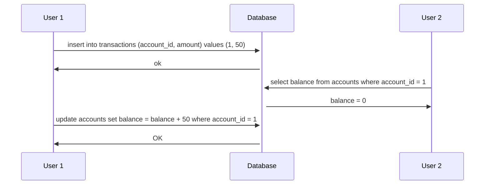
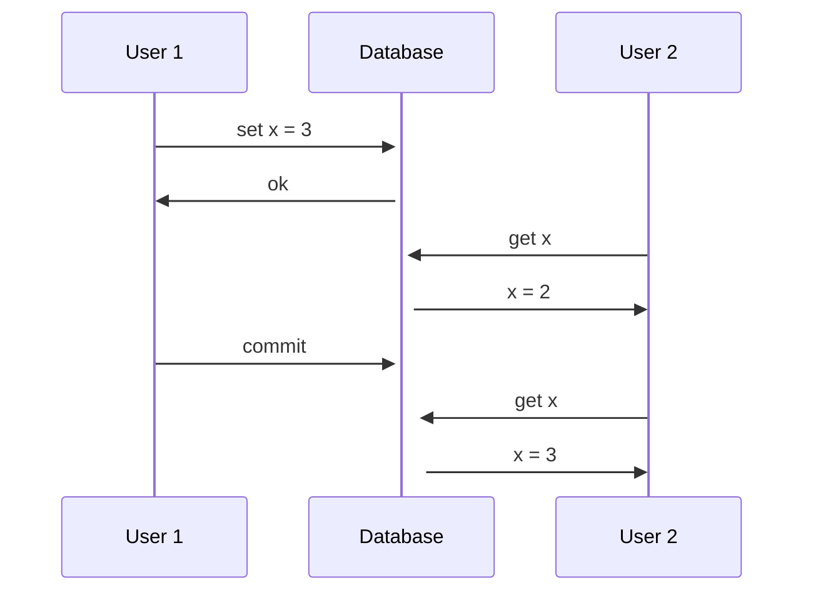
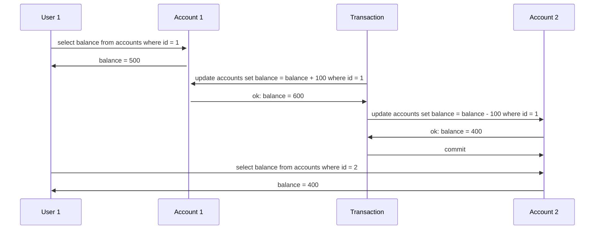
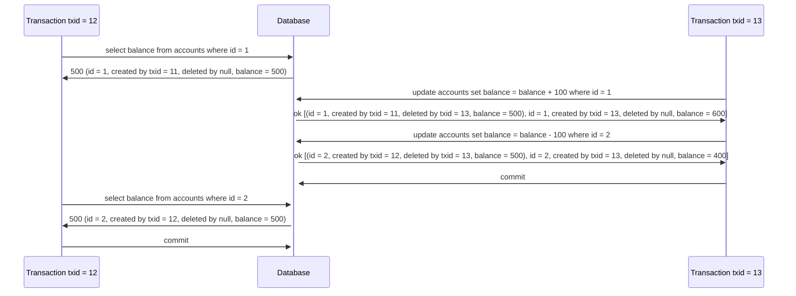

# Chapter 7 - Transactions

Conceptually, a transaction is a way for an application to group several reads and writes together into a logical unit.
Either all reads and writes in a transaction are reflected in the database, or none of them are.

By using transactions, the application can ignore certain potential errors.

With the hype of NoSQL databases, transactions are sometimes seen as the anthitesis of scalability. So some people think
that, in order to achieve scalability, we need to give up on transactions. In the other hand, some people think that
transactions are a fundamental building block of databases if you work with "serious" data.

## ACID

The safety guarantees that transactions provide are usually described by the acronym ACID: Atomicity, Consistency,
Isolation and Durability. Systems that don't provide these guarantees are sometimes called BASE (Basically Available,
Soft state, Eventual consistency).

### Atomicity

Atomic means something that cannot be broken down into smaller parts. In the context of databases, atomicity means that,
if operations are grouped together into a transaction and something goes wrong during its execution, the transaction is
**aborted** and the database state is left unchanged. When it finishes, it **commits** all the changes at once.

### Consistency

The letter C doesn't really belong to ACID. It basically guarantees that you don't violate any integrity constraints.
For example, in an accounting system, credits and debits must always be balanced, this is called an **invariant**.

The database can't really guarantee that it will always be balanced. This is the application's responsibility. The 
database will provide **atomicity** and **isolation** so that the application can achieve **consistency**.

### Isolation

Concurrently executing transactions are isolated from each other: they cannot step on each other's toes. An example
of a violation of isolation can be seen in the following scenario:

We have a race condition here. Both users read the counter, and then set it to 43. The second user overwrote the first
user's change.

A fully isolated database would be called **serializable**, which means that every transaction is executed one after
the other, as if they were running in a single thread. However, this is not practical, because it would be too slow.
So, some databases implement **snapshot isolation**. We'll talk about it later.

### Durability

It's the promise that once a transaction has been committed, it will remain so. Typically, it means that the data 
will be written to a non-volatile storage. It usually considers the write-ahead log or something similar. Also, in 
replicated databases, it means that the data has been successfully copied to some number of nodes.

## Multi-Object Operations

Multi-object transactions are needed when we want to update several objects at once. For example, imagine a database
that stores bank account balances with two tables: accounts and transactions. The accounts table contains the current
balance of each account, and the transactions table contains the history of transactions. When a transaction is made,
a new row is inserted into the transactions table, and the balance of the account is updated in the accounts table.

This shows the need for _atomicity_. Imagine if an error occurs after the transaction is inserted, but before the account
balance is updated. The account balance would be inconsistent with the transaction history.

Many distributed databases abandoned multi-object transactions because it is hard to implement them when we are dealing
with partitions.

## Single-Object Operations

If you want to update a single object, a transaction can be used:
- If you are writing a big object, such as a JSON document, and there is an error in the middle of the write
- If you are overriding a value and there is an outage in the middle of the write
- If another client reads the same object at the same time a write is happening, which value should they see?

In these cases, _atomicity_ can be achieved by using logs for crash recovery and _isolation_ can be achieved by using 
locks.

## Handling Errors

When a transaction is aborted in a system that guarantees ACID properties, the database will discard any changes that
were made, and it can be retried by the application.

Although this is simple, it is not perfect:
- The transaction can actually be succeeded but the client didn't receive the successful commit. In this case, the
client may retry the same transaction.
- If the error is due to some overload, retrying the transaction may make the problem worse.
- A retry would be pointless if the error was caused due to a non-transient error, such as a violated foreign-key.

## Weak Isolation Levels

Race conditions happen when two transactions are trying to read and write the same data concurrently.

In theory, the strongest isolation level would make the developers think that there is no concurrency at all, because
all transactions are executed in a **serial** order. However, this is not practical, because it would be too slow. In
practice, systems work with weaker isolation levels, so they are protected against **some** concurrency issues.

A popular comment is: Use ACID databases when you are handling financial data. However, due to the fact that popular
databases use weak isolation, they won't necessarily prevent bugs to happen.

Taking this into account, we can't simply ignore concurrency issues, we need to have a good understanding on which 
things can go wrong, and how to avoid them using the tools we have.

### Read Committed

The guarantees it makes are:
1. When reading, we'll always see data that was already committed (no dirty reads).
2. When writing, we'll only overwrite data that was already committed (no dirty writes).

Read committed is one of the most popular isolation levels, being the default setting in many databases.

To prevent dirty writes, row-level locks are used. When a transaction wants to write to a row, it first needs to
acquire a lock on that row. If another transaction already has a lock on that row, the second needs to wait until the 
first commits or aborts.

To prevent dirty reads, locks could be used as well, however, it would cause a lot of slowness, since long-running 
writes could block reads for a long time. So, instead of that, databases keep track of both values when a transaction
is writing a new value. When a transaction reads a value, it will check if the value was committed. If it was, it will
return the value. If it wasn't, it will return the old value.

### Snapshot Isolation and Repeatable Read

With read committed, we can still have concurrency issues:

Here, user 1 is trying to transfer money from account 2 to account 1. In total, they should have 1000, but at the moment
user 1 queried both accounts, the sum was 900, because when they queried account 1, the transaction was not committed
yet, but when they queried account 2, it was already committed. 

This is called a **read skew** and is an example of a **non-repeatable read**. It happens when a transaction reads the
same row twice, but the result of the second read is different from the first one. If the user tries to query both 
accounts again, they will see the correct balance. It's considered acceptable in a read committed isolation.

However, some use cases cannot tolerate this kind of problem:
- Backups: If you want to take a backup of the database, you will need to read all data, which takes a long time.
While this happens, more writes are coming, so we could end up with some parts containing old data and some parts
containing new data.
- Analytics: If a query scans a large part of data, it could take a long time and may return nonsensical results.

The most common solution for this is to use **snapshot isolation**. The idea is that transactions will read from a
snapshot of the database. When a transaction starts, it will see data that was committed in the start of it.

In order to implement it, databases use locks to prevent dirty writes, but reads do not require any locks. This allows
the database to execute long-running read queries on a snapshot while accepting writes.

#### Implementing Snapshot Isolation with MVCC

The most common way to implement snapshot isolation is by using **multi-version concurrency control (MVCC)**. The idea
is that the database must keep several committed versions of an object, since different transactions will need to see
them in different points in time.

