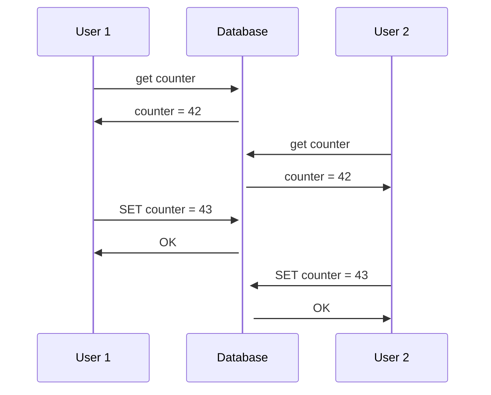
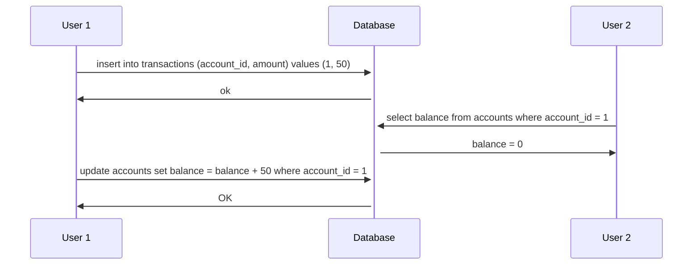
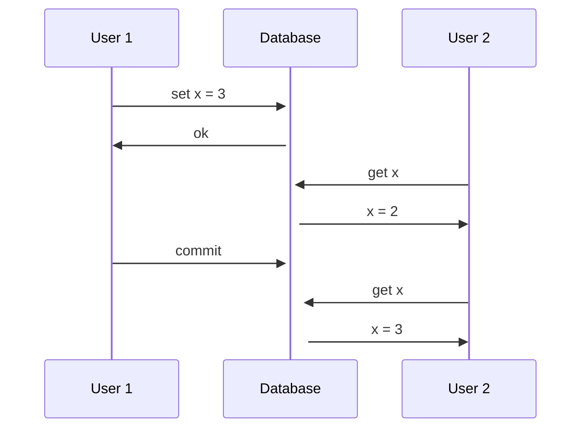
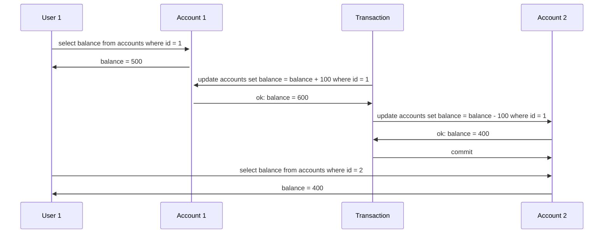
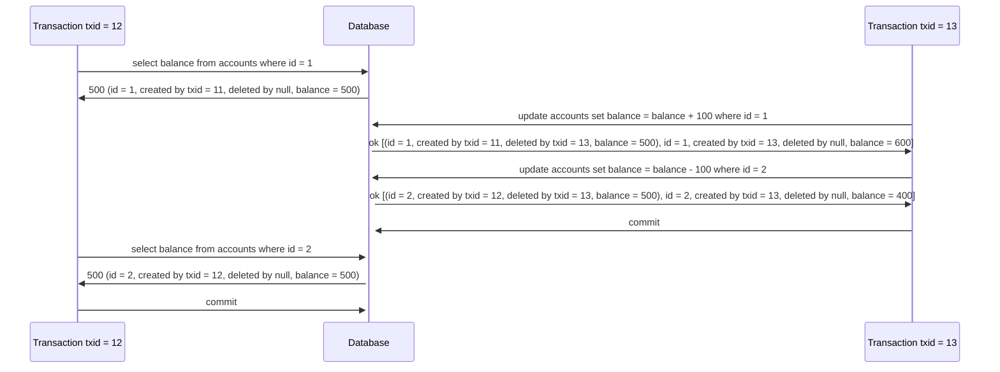
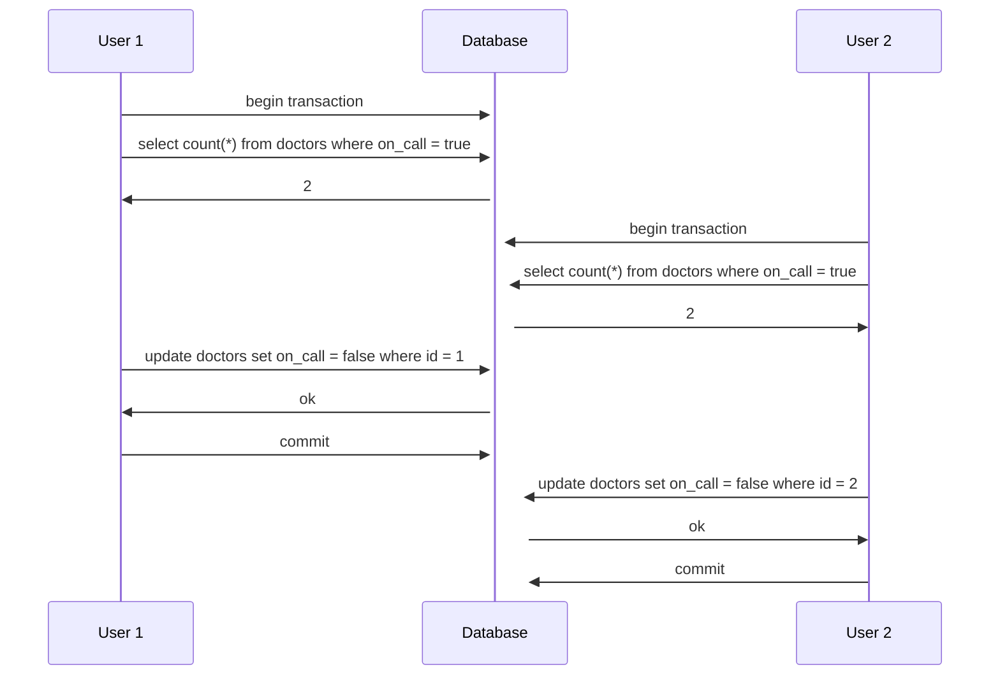

# Chapter 7 - Transactions

Conceptually, a transaction is a way for an application to group several reads and writes together into a logical unit.
Either all reads and writes in a transaction are reflected in the database, or none of them are.

By using transactions, the application can ignore certain potential errors.

With the hype of NoSQL databases, transactions are sometimes seen as the anthitesis of scalability. So some people think
that, in order to achieve scalability, we need to give up on transactions. In the other hand, some people think that
transactions are a fundamental building block of databases if you work with "serious" data.

## ACID

The safety guarantees that transactions provide are usually described by the acronym ACID: Atomicity, Consistency,
Isolation and Durability. Systems that don't provide these guarantees are sometimes called BASE (Basically Available,
Soft state, Eventual consistency).

### Atomicity

Atomic means something that cannot be broken down into smaller parts. In the context of databases, atomicity means that,
if operations are grouped together into a transaction and something goes wrong during its execution, the transaction is
**aborted** and the database state is left unchanged. When it finishes, it **commits** all the changes at once.

### Consistency

The letter C doesn't really belong to ACID. It basically guarantees that you don't violate any integrity constraints.
For example, in an accounting system, credits and debits must always be balanced, this is called an **invariant**.

The database can't really guarantee that it will always be balanced. This is the application's responsibility. The 
database will provide **atomicity** and **isolation** so that the application can achieve **consistency**.

### Isolation

Concurrently executing transactions are isolated from each other: they cannot step on each other's toes. An example
of a violation of isolation can be seen in the following scenario:



We have a race condition here. Both users read the counter, and then set it to 43. The second user overwrote the first
user's change.

A fully isolated database would be called **serializable**, which means that every transaction is executed one after
the other, as if they were running in a single thread. However, this is not practical, because it would be too slow.
So, some databases implement **snapshot isolation**. We'll talk about it later.

### Durability

It's the promise that once a transaction has been committed, it will remain so. Typically, it means that the data 
will be written to a non-volatile storage. It usually considers the write-ahead log or something similar. Also, in 
replicated databases, it means that the data has been successfully copied to some number of nodes.

## Multi-Object Operations

Multi-object transactions are needed when we want to update several objects at once. For example, imagine a database
that stores bank account balances with two tables: accounts and transactions. The accounts table contains the current
balance of each account, and the transactions table contains the history of transactions. When a transaction is made,
a new row is inserted into the transactions table, and the balance of the account is updated in the accounts table.



This shows the need for _atomicity_. Imagine if an error occurs after the transaction is inserted, but before the account
balance is updated. The account balance would be inconsistent with the transaction history.

Many distributed databases abandoned multi-object transactions because it is hard to implement them when we are dealing
with partitions.

## Single-Object Operations

If you want to update a single object, a transaction can be used:
- If you are writing a big object, such as a JSON document, and there is an error in the middle of the write
- If you are overriding a value and there is an outage in the middle of the write
- If another client reads the same object at the same time a write is happening, which value should they see?

In these cases, _atomicity_ can be achieved by using logs for crash recovery and _isolation_ can be achieved by using 
locks.

## Handling Errors

When a transaction is aborted in a system that guarantees ACID properties, the database will discard any changes that
were made, and it can be retried by the application.

Although this is simple, it is not perfect:
- The transaction can actually be succeeded but the client didn't receive the successful commit. In this case, the
client may retry the same transaction.
- If the error is due to some overload, retrying the transaction may make the problem worse.
- A retry would be pointless if the error was caused due to a non-transient error, such as a violated foreign-key.

## Weak Isolation Levels

Race conditions happen when two transactions are trying to read and write the same data concurrently.

In theory, the strongest isolation level would make the developers think that there is no concurrency at all, because
all transactions are executed in a **serial** order. However, this is not practical, because it would be too slow. In
practice, systems work with weaker isolation levels, so they are protected against **some** concurrency issues.

A popular comment is: Use ACID databases when you are handling financial data. However, due to the fact that popular
databases use weak isolation, they won't necessarily prevent bugs to happen.

Taking this into account, we can't simply ignore concurrency issues, we need to have a good understanding on which 
things can go wrong, and how to avoid them using the tools we have.

### Read Committed

The guarantees it makes are:
1. When reading, we'll always see data that was already committed (no dirty reads).
2. When writing, we'll only overwrite data that was already committed (no dirty writes).


Read committed is one of the most popular isolation levels, being the default setting in many databases.

To prevent dirty writes, row-level locks are used. When a transaction wants to write to a row, it first needs to
acquire a lock on that row. If another transaction already has a lock on that row, the second needs to wait until the 
first commits or aborts.

To prevent dirty reads, locks could be used as well, however, it would cause a lot of slowness, since long-running 
writes could block reads for a long time. So, instead of that, databases keep track of both values when a transaction
is writing a new value. When a transaction reads a value, it will check if the value was committed. If it was, it will
return the value. If it wasn't, it will return the old value.

### Snapshot Isolation and Repeatable Read

With read committed, we can still have concurrency issues:



Here, user 1 is trying to transfer money from account 2 to account 1. In total, they should have 1000, but at the moment
user 1 queried both accounts, the sum was 900, because when they queried account 1, the transaction was not committed
yet, but when they queried account 2, it was already committed. 

This is called a **read skew** and is an example of a **non-repeatable read**. It happens when a transaction reads the
same row twice, but the result of the second read is different from the first one. If the user tries to query both 
accounts again, they will see the correct balance. It's considered acceptable in a read committed isolation.

However, some use cases cannot tolerate this kind of problem:
- Backups: If you want to take a backup of the database, you will need to read all data, which takes a long time.
While this happens, more writes are coming, so we could end up with some parts containing old data and some parts
containing new data.
- Analytics: If a query scans a large part of data, it could take a long time and may return nonsensical results.


The most common solution for this is to use **snapshot isolation**. The idea is that transactions will read from a
snapshot of the database. When a transaction starts, it will see data that was committed in the start of it.

In order to implement it, databases use locks to prevent dirty writes, but reads do not require any locks. This allows
the database to execute long-running read queries on a snapshot while accepting writes.

#### Implementing Snapshot Isolation with MVCC

The most common way to implement snapshot isolation is by using **multi-version concurrency control (MVCC)**. The idea
is that the database must keep several committed versions of an object, since different transactions will need to see
them in different points in time.



In this example, when transaction 12 starts, it will see the old value of account 1, because it was created by
transaction 11, which was committed before transaction 12 started.

The rules for snapshot isolation are:
- When a transaction starts, transactions that are in progress will not be visible.
- When a transaction starts, writes made by transactions that committed after it started will not be visible.
- When a transaction starts, writes that were aborted after it started will not be visible.

An object will be visible if both conditions are true:
- At the time the transaction is reading started, it was already committed.
- The object is not marked for deletion or the transaction that marked it for deletion has not yet committed.

#### Indexes in snapshot isolation

In a snapshot isolation context, indexes can point to multiple versions of the same object. When a read transaction
needs to read it, the query will filter out the versions that are not visible to the transaction.

Some databases that use B-Tree indexes use an append-only variant, meaning that when a row is updated by a transaction,
a new copy of the page is written, and the parent pages are updated to point to the new page.

#### Naming of snapshot isolation

The name snapshot isolation is not used by all databases. For example, Postgres calls it **repeatable read**, Oracle 
calls it **serializable** and SQL Server calls it **snapshot isolation**.

MySQL is not qualified as snapshot isolation because it doesn't detect lost updates automatically. 

### Preventing Lost Updates

One of the most common concurrency problems is the **lost update**. It happens when two transactions concurrently
perform a read-modify-write cycle. For example:
1. Incrementing a counter or an account balance
2. Making a local change to a complex value, such as a JSON document
3. Two users editing a document at the same time, each saving their changes independently

A variety of solutions have been proposed to solve this problem:

#### 1- Atomic write operations

Operations provided by the database that removes the need of the application to read the value before writing it.

```sql
UPDATE counters SET value = value + 1 WHERE id = 1;
```
This will take an exclusive lock on the object when they read it, so no other transaction will be able to access it
until it gets committed or aborted.

Not all cases fit for this solution. For example, if a user wants to update a wiki page it would involve text editing.

#### 2- Explicit locking

Some databases provide a way to explicitly lock objects during a transaction. In a multiplayer game, for example,
a character would only be moved by one user at a time, but it also involves some logic, so we can't use atomic writes.

```sql
BEGIN TRANSACTION;
SELECT * FROM characters WHERE id = 1234 FOR UPDATE;

-- Application logic to move the character

UPDATE characters SET x = 1, y = 2 WHERE id = 1234;
COMMIT;
```

#### Detecting Lost Updates

The options we saw above try to prevent lost updates by making transactions run in a serializable order. However,
we can allow them to run concurrently and make the transaction manager detect lost updates.

This makes the application simpler, because developers might forget to use explicit locks or atomic writes. With this
approach we make the solution less error-prone.

#### 3- Compare-and-set

Some databases adopt a different approach. With compare-and-set, the database will allow an update to happen only if
the value has not changed since it was last read. This is also called **optimistic concurrency control**.

```sql
UPDATE pages SET content = 'New content' 
WHERE id = 1 
AND content = 'Old content';
```

This may work or not, because if we use snapshot isolation, the transaction will see the old value, so even if another
user changed the content, the transaction will still be able to update it.

Before using compare-and-set, we need to check if it's safe or not.

#### Conflict resolution and replication

In replicated databases, preventing lost updates goes to another level, since they have copies of the data on several
nodes and sometimes different nodes can accept writes for the same key. Techniques we saw until now don't apply here.

A common approach is to use **last write wins**. When a conflict is detected, the last write will overwrite the previous
one. However, it is prone to cause lost updates.

Another approach is to allow concurrent writes to create different versions of the same object and use application
logic to merge them after it happened.

### Write Skew and Phantoms

The mechanisms we saw until now are not enough to prevent all concurrency issues. For example, imagine a table that
controls doctors who need to be on-call at a hospital. There is a rule that says that there should be at least one
doctor on-call at all times.



In this example, the application controls whether the doctor can remove themselves from the on-call list. However, 
since the two doctors queried it concurrently, they both got 2 on-calls on the same transaction, since snapshot isolation
was used. Both transactions committed and now there are no doctors on-call.

This is not a dirty write, since both transactions didn't write to the same object. This is characterized as a **write
skew**. It's less obvious, but it's still a race condition. If the transactions were running serially, the second one 
would have failed.

The best option to prevent this without the need to serialize transactions is to explicitly lock the rows that are
going to be used, for example:

```sql
BEGIN TRANSACTION;
SELECT * FROM doctors WHERE on_call = true FOR UPDATE;

UPDATE doctors SET on_call = false WHERE id = 1;
COMMIT;
```

More examples of write skew are:
- **Meeting room booking system**: If two people try to book the same room at the same time, if both transactions run
concurrently, they will both see that the room is available, and both might book it.
- **Multiplayer game**: If two players try to move different characters to the same location, they might both see that
the location is empty and move their characters there.
- **Claiming a username**: If two users try to claim the same username, they might both see that the username is 
available and claim it. A unique constraint would help here since the second transaction would fail.

All of these examples follow the same pattern:
1. A SELECT query runs to check if some requirement is satisfied.
2. Based on the result of the query, the application decides what to do next.
3. The application performs an insert/update/delete to make the change.
4. The precondition that was checked in step 1 is now violated.

We could use the SELECT FOR UPDATE pattern to prevent some of these problems, for example the example of the on-call
doctors. However, in some examples this would not work, because there would be no rows to lock. There is no row to
lock in the multiplayer game because the location is empty, and there is no row to lock in the username example because
the username is available. The initial SELECT query return no rows for both cases.

This effect is called **phantom**. It happens when a write in one transaction affects the result of a query in another
transaction.

#### Preventing phantoms with materialized conflicts

The problem of phantoms is that there are no rows to lock. However, as an alternative, we can have a second table that
represents the state of what we are working with. For example, in the meeting room system, we can have a table that
contains the list of rooms and the time slots that are available. When a user tries to book a room, we can use the
SELECT FOR UPDATE pattern to lock the row that represents the room and the time slot. If another transaction tries
to do the same, it will create a lock conflict, and it will fail.

This should be used with caution because it can be error-prone and also leaks database implementation details into the
application layer.

## Serializability

Serializable is usually seen as the strongest isolation level. It guarantees that two transactions that run concurrently
will have the same effect as if they ran serially, one after the other.

There are three ways to implement it:
1. Literally running transactions in a serial order.
2. Two-phase locking (2PL)
3. Serializable snapshot isolation (SSI)

### Actual Serial Execution

It's the simplest way to avoid concurrency: literally eliminate it. Execute one single transaction at a time in the
same thread.

It has the obvious drawback of having the throughput limited by a single thread, so transactions need to be structured
differently:

1- Using stored procedures
If we have a single thread executing transactions, they need to be short, so we can't have, for example, a transaction
running and waiting for another input from the user. Instead, we can use a stored procedure to execute instructions at
once.

It has some drawbacks, such as: each database has its own language for it and code tends to be more difficult to debug, 
test and maintain, although some databases have been changing it to use more common languages, such as Java, Lua and
Clojure.

It also has some advantages. If we can keep transactions short, we can optimize the I/O operations and avoid concurrency
control mechanisms, achieving a good-enough throughput.