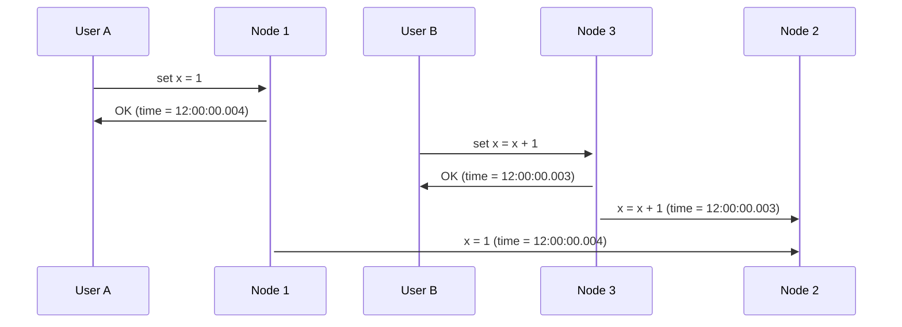

# Chapter 8 - The Trouble with Distributed Systems

When we work with distributed systems, a lot of things can go wrong. We can even assume that anything that can go wrong
**will** go wrong at some point.

This can include:
- Network problems
- Clocks out of sync
- Software bugs

## Faults and Partial Failures

When we are working with a single computer, we can assume that operations work in a deterministic way. If we have
hardware in perfect conditions, problems are caused by buggy software. And if we face eventual hardware problems, we
stop entirely the system, for example, a memory corruption or a total failure, such as a power outage.

In a distributed system, we no longer operate in an idealized model. Some parts of the system might be working while
others are not. This is called a **partial failure**.

As opposed to running in a single machine, partial failures are **non-deterministic**. You can try to run the same
command multiple times and get different results. We may not even know if a failure has occurred.

When we work with partial failures, fault handling is a key concept that the application needs to be aware of. Usually,
these applications have some common characteristics:
- They are distributed across different machines
- They communicate over a network
- Depending on geographical location, they communicate over a long distance
- They depend on the internet, which might not be 100% reliable

## Unreliable Networks

Distributed systems are built on top of networks, which are not reliable and use the Internet Protocol (IP), which is
asynchronous and unreliable.

When we send a message over the network, we don't know if:
- The recipient is online
- The recipient is reachable
- The recipient received the message and processed it

A lot of things can happen in this process. The remote node may have failed, or the network may have failed. Maybe
the node has processed the message but the response was lost on the way back because of a network failure or even
your own node couldn't receive it.

## Detecting Faults

As we saw, in a distributed environment we need to be able to detect and handle faults.

- A load balancer needs to detect when a server is down and stop sending requests to it
- A database needs to detect if the leader is down and elect a new one

However, these processes are not simple. We can have situations where the node crashed while some process was running,
and we don't necessarily know whether it was successful or not.

We can mitigate some of these issues. For example, TCP protocol acknowledges when packages are received, but we can't
count on it fully. The application might have crashed before processing the message, and the sender will never know.

We can also get error responses and, even if we don't get a response, retry the request a few times, and declare the 
node dead if we don't get a response after a few attempts.

## Timeouts and Unbounded Delays

Timeouts are one of the most used techniques to detect faulty nodes or services. Howver, it's not simple to define them:
- A high timeout can make the system slow to detect faults
- A low timeout can make the system declare a node as faulty when it's not

If a node is declared dead, the system needs to ensure that other nodes receive requests that would be sent to the
dead node. This makes these nodes to start processing more data, if they are already struggling with high load, this
can be problematic.

Declaring a node dead can also make us retry requests to other nodes, and they might end up being processed twice.

A lot of things can happen to make the time for a request to vary:
- If several requests are being sent over the network, they might be queued by the network switch. If the queue is full,
the switch might drop some packages.
- When the packet reaches the recipient, it might be queued again if all CPU cores are busy.
- The OS might pause the process in order to process other tasks, and data might be queued again.
- TCP might apply backpressure to avoid overloading a network link.

TCP will also wait for the packages to be acknowledged, and if it doesn't receive the acknowledgment, it will resend
them all over again. Lost packages are also retransmitted.

In public clouds, resources are shared among different users, and the network might be congested by a "noisy neighbor".

## Synchronous and Asynchronous Networks

We can use telephone calls to give an example of synchronous communication. When we call someone, a circuit is 
established and the network guarantees that the voice call will have an allocated bandwidth at the entire time. This
kind of network is synchronous. Data doesn't suffer any queuing, because it already has a guaranteed bandwidth.

In the other hand, TCP connections are asynchronous. It will try to use whatever bandwidth is available. If you give
it some data to send, it will try to do it in the shortest amount of time with the available bandwidth. If the 
connection is idle, it won't use any bandwidth.

Datacenter networks use packet switching network because they are projected for bursty traffic, different from phone
or video calls which are continuous. We always want to complete a request as quickly as possible. Using circuits for
bursty traffic would be inefficient because if the bandwidth is too low, it would take a lot of time to complete the
request, and if the bandwidth is too high, it could waste resources, or it might not be able to set up. So, TCP will 
dynamically allocate the necessary amount of bandwidth to complete the requests.

However, there are some attempts to build hybrid models of network. With the correct approach, we can emulate a 
synchronous model on packet networks.

## Unreliable Clocks

In a distributed system, each node has its own clock, which are not perfectly synchronized. This can make it hard to
understand certain things, such as order of events that happened across the machines.

Computers have at least two types of clocks:
- **Time-of day clock**: It returns the current date and time according to a calendar. These clocks are synchronized
with the NTP protocol, which is a protocol that allows computers to synchronize their clocks over a network. So,
ideally, these clocks should be in sync.
- **Monotonic clock**: These are clocks that always move forward in time, so they are ideal to measure time intervals.
The absolute value of these clocks are meaningless. It might be the number of nanoseconds since the computer was
started, for example. The NTP protocol allows these clocks to be speeded up or slowed down in case they are moving
too fast or too slow.

### Clock Synchronization

Only time-of-day clocks need to be synchronized. It's usually done using an NTP server. However, it's not simple to
synchronize clocks over a network.
- The quartz crystal that is inside the computer is not perfect, it might drift over time depending on conditions such
as temperature.
- If the clock differs too much from the NTP server, it might refuse to synchronize or be forcibly reset. Applications
might see time going backwards or forward suddenly.
- Network problems might affect the synchronization process.
- Leap seconds are added to the calendar to keep it in sync with the Earth's rotation. This can make the clock go
backwards or forwards by one second.

We previously saw the concept of LWW (Last Write Wins) in a distributed system. This is a common way to resolve conflicts
in multi-leader databases. However, we can fall into problems if clocks are not fully synchronized between nodes.



Here, although the increment of x happened after we set x to 1, the time of it is lower than the time of the first 
operation, and this update would be lost.

This can cause data to be suddenly lost without any error message.

Since monotonic clocks are hard to be synchronized, whenever possible, it's a better alternative to rely on logical
clocks, which are not based on the absolute time, but on the order of events.

#### Clocks confidence interval

When using a time-of-day Clock, it's impossible to be sure on the exact time it is reporting us. If we have just a 
physical clock, the manufacturer will tell us the accuracy it has. However, in our case, we have clocks that can
vary based on the quartz drift, the NTP server and the network. Our uncertainty will be the sum of all these factors.

Picture this code which checks a lease set to a database node indicating it's the leader of its partition:

```java
while (true) {
    var request = getIncomingRequest();
    
    if (lease.expireMillis - System.currentTimeMillis() < 10000) {
        lease.renew();
    }
    
    if (lease.isValid()) {
        processRequest(request);
    }
}
```

This code has an issue: It compares the current time with the lease expiration time, which was set by another node. If
clocks are out-of-sync, this comparison might not work as expected.

Another issue that might happen is, if there is a pause in processing for more than 10 seconds between the check and
the process request, the lease would still be valid for the process, however another node might have already taken the
leadership. This can happen in some scenarios:
- A stop-the-world garbage collection happens;
- The virtual machine gets suspended, saving processes' execution to disk and continuing;
- The operating system pauses the running thread to give time to another thread, or because of swapping;
- UNIX process paused by a SIGSTOP signal;
