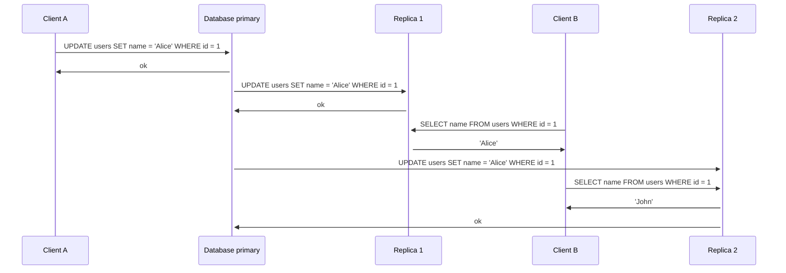
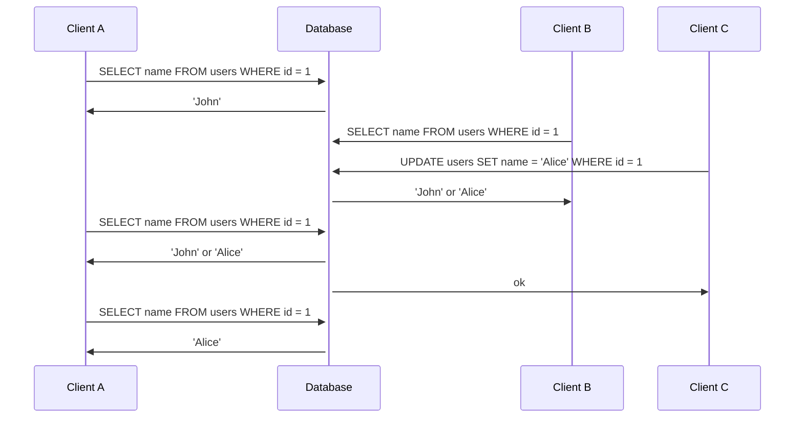
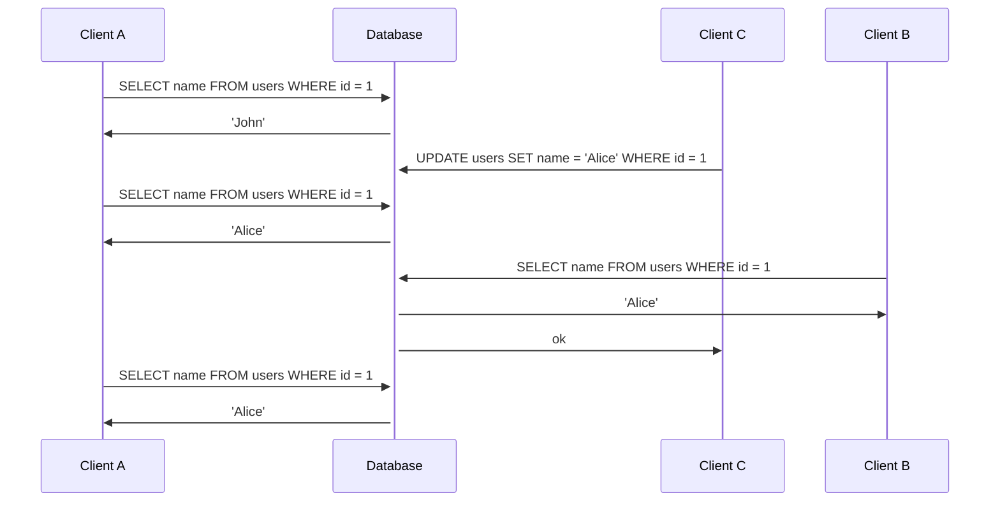
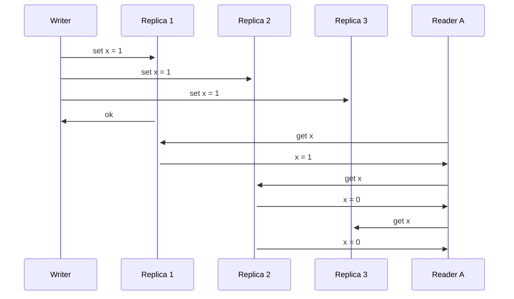

# Chapter 9: Consistency and Consensus

In the past chapter, we saw how distributed systems can fail. We need then to find ways to handle these failures
gracefully, since we cannot afford the entire system to go down every time there is a failure.

This chapter presents some algorithms that abstracts the complexity of handling failures from the application layer.
One of the most important concepts is **consensus**, which is the process of getting multiple nodes to agree on 
something.

For example, if you are using a database with single-leader replication and the leader goes down, the remaining nodes
can use consensus to elect a new leader.

## Consistency Guarantees

If you look at two different nodes of a database at the same time, it's likely that you will see different values, 
since data is being constantly updated and replicated.

Most replicated databases offer at lease an **eventual consistency** guarantee, which means that, if you stop writing 
data and wait for some time, all nodes will eventually return the same value. Another name for this is **convergent 
consistency**.

There is some similarities between consistency guarantees and transaction isolation levels, however, they mean different
things. Consistency guarantees handle data that is replicated across multiple nodes, whereas isolation level refers
to how database handles concurrent transactions.

The strongest consistency guarantee is **linearizability**.

### Linearizability

The idea behind linearizability is to behave as it there is only one copy of the data. As soon as the client makes a
write, the value is immediately visible to all clients, no matter which node they are reading from. This is also known 
as **atomic consistency**.

This example shows a violation of linearizability. Client B gets 'John' as value on the second query, since the write
hasn't been replicated to the second replica yet.

For the next examples, let's abstract primaries and replicas and just call it a "Database". So when clients are querying
it doesn't matter which node they are querying from.

In this example, we have some constraints that we can assume:
- When client A first queries the database, client C didn't start the write operation, so the value returned is 
definitely 'John'.
- When client A and B queries the database for the second time, the write operation from client C has already started 
but not finished, so the value returned can be either 'John' or 'Alice'.
- When client A queries the database for the third time, the write operation from client C has already finished, so the
value returned is definitely 'Alice'.

This is still not enough to make this database linearizable, since when client A and B queries the database for the
second time, they can get different results. To make it linearizable, we need to add another constraint.

At some point in time, the value returned by the database must change from 'John' to 'Alice'. Once this happens, the
value returned by the database must be 'Alice' for all subsequent queries.

Now, when client A receives the value 'Alice', all other queries must return 'Alice' as well. This is the definition of
linearizability.

While linearizability and serializability are similar concepts, they are meant to solve different problems:
- Linearizability is about guaranteeing consistency between reads and writes of an object across different replicas.
- Serializability is about guaranteeing consistency between transactions writing to the same object.

A database can provide both serializability and linearizability, which is called **strict serializability**.

Serializability based on 2PL are typically linearizable, since when a write acquires a lock, other reades need to wait
until the write is finished.

Snapshot isolation, in the other hand, is not linearizable, since it allows reads to see the state of the database at
different points in time.

Some use cases for linearizability are:
- Implementations of locks and semaphores: if a client acquires a lock, it must be immediately visible to all other
clients.
- Unique constraints: primary keys, unique indexes, etc.

### Implementing Linearizability

When we talk about replicated databases, there are different types of them and each of them has its own way of making
writes visible to all clients.

- **Single-leader replication**: Pontentially linearizable, since you can make reads from the leader and replications
to be synchronous.
- **Multi-leader replication**: Not linearizable, since writes can be made to different leaders, they may produce
conflicts.
- **Leaderless replication**: Not linearizable. It seems that with a strict quorum system, it could be linearizable, but
we can have race conditions and conflicts due to multiple writes as well.

In this example, even though we have data being replicated to all replicas synchronously, we can still get stale reads
after getting the updated value if we go to different replicas.

It **is** possible to make a leaderless replication system linearizable, at the cost of performance. The idea is to
perform read repairs synchronously and the writers to read the latest value from the quorum before writing the new
value. Some databases perform this, such as Cassandra, however they still can't guarantee linearizability because of
the way they handle conflicts (last-write-wins).

To make them linearizable, they would require a consensus algorithm, so it's safer to assume that **leaderless systems 
does not provide linearizability**.

### The Tradeoffs of Linearizability

Imagine we have a database distributed in two datacenters. It can be either a multi-leader or a single-leader system.
- If it is a multi-leader system and the network link goes down, both datacanters can continue operating, however,
we won't have linearizability, since data will eventually be stale.
- If it is a single-leader system and the network link goes down, the follower will stop receiving updates, if the 
application requires linearizability, it will stop operating for clients that are connected to the follower.

This issue can happen in any of the replication configurations, it doesn't even need to be in different datacenters.

So, if some replicas are disconnected:
- If your application requires linearizability, these replicas cannot serve any operation.
- If not, each replica can process requests independently, but you can get stale reads, making the application more
**available**.

#### CAP Theorem

The CAP theorem is usually stated as Consistency, Availability and Partition Tolerance, and that we need to pick two,
but this is not quite complete.

Partition tolerance is something that will always happen, we can't avoid it. A better way of rephrasing it is:
- When a network **partition** happens, we need to choose between **consistency** and **availability**.

CAP usually only considers consistency model (linearizability) and just one kind of fault (network partition). It 
doesn't consider other kinds of faults, such as node failures, which can also affect the system, so we need to consider 
other tradeoffs as well instead of relying purely on it.

#### Few Systems are Actually Linearizable

If we think on a single computer operating, we'd expect that if we write a value to its memory, all subsequent reads
will return the same value, making it linearizable.

However, if we have multiple threads running in multiple cores, each of them with its own cache, we can get stale reads
as well, since the caches are not synchronized.

Could this be different? Yes, but it would be much slower, so the decision here is not between network partition and
linearizability, but between performance and linearizability. The chosen was to make it faster, and it is like that
for many other systems.