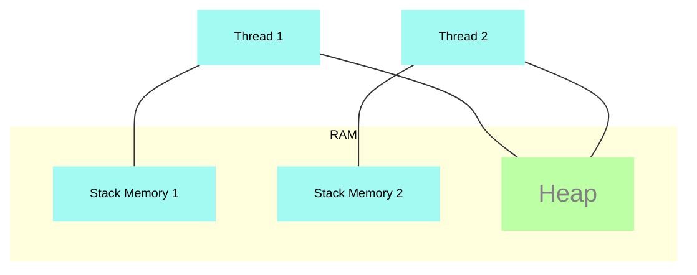
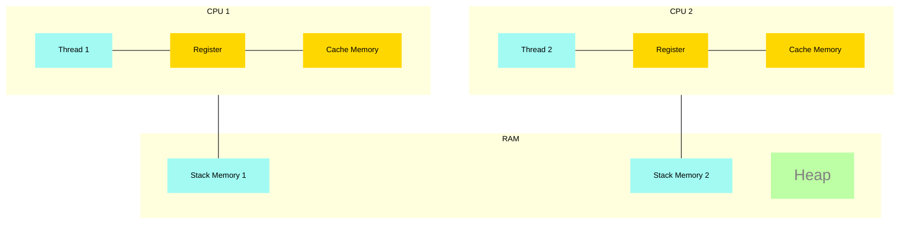

# Advanced Java - Threads and Concurrency

## Synchronization

### Memory access and problems

Threads are independent execution sequences that make use of shared memory. The RAM memory is categorized into stack and
heap. In a nutshell:
- The stack memory is used to store primitive variables and references to objects.
- The heap memory is used to store objects.

When a thread is created, it will have its own **stack memory**, and it will be private to that thread. However, the
**heap memory** is shared among all threads.

So, the stack for each thread will hold local variables and references to objects that are in the heap.

If we have a shared object between two threads, for example, a counter, there is no guarantee that the threads will see
the same value of the counter and, when incrementing it, the value might be lost.

If we see the example at [this class](courses/java-concurrency/concurrency-project-examples/src/main/java/org/concurrency/example/chapter_1/ConcurrentAccessRunnable.java) 
there is no deterministic output, because both threads are sharing the same Runnable instance and the counter is being
incremented by both threads, so one can get stale data and some increments might be lost.

Let's add more information to the diagram by representing the CPU cache and registers:

The CPU has its own register and cache memory, which have a much faster access time than the RAM memory. When the past
example was running, a possible issue is that this sequence of execution happens:
1. Thread 1 reads the counter value from the heap and stores it in the cache memory (counter = 0).
2. Thread 2 reads the counter value from the heap and stores it in the cache memory (counter = 0).
3. Thread 1 increments the counter in the cache memory (counter = 1).
4. Thread 2 increments the counter in the cache memory (counter = 1) and to the heap (counter = 1).
5. Thread 1 writes the counter value it has in the cache memory to the heap (counter = 1).

The expected value here would be 2, because we had 2 increments. However, the value is 1 because the increment of Thread
2 was lost.