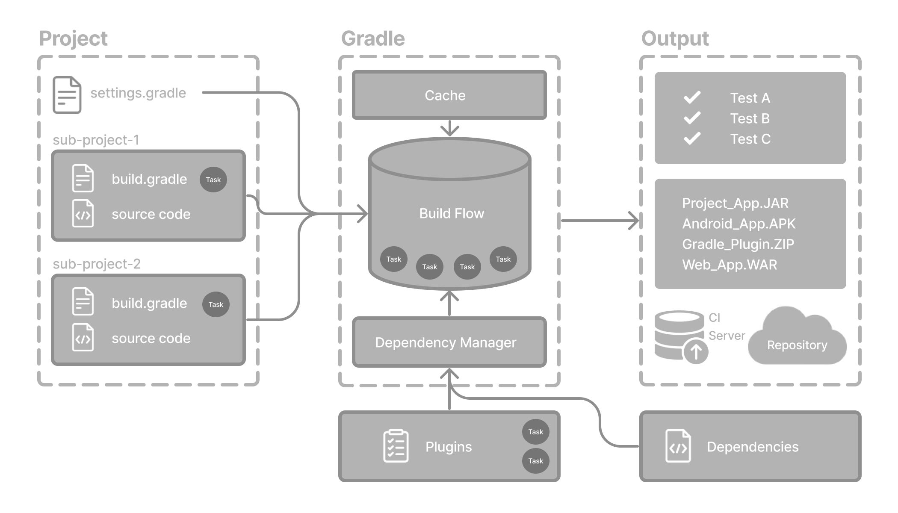

# Gradle Study - Plan A

_"I need to be able to explain the main concepts of Gradle"_

Main source: [Gradle documentation](https://docs.gradle.org/current/userguide/userguide.html)

## What is Gradle?

Gradle is the most popular build tool for JVM-based applications. It's tha default ecosystem to Android
and Kotlin multiplatform projects. We can automate a wide range of build scenarios with built-in functionality,
custom logic and plugins.

It provides optimizations, such as:
- Caching
- Parallelization

It provides a tool called **build scan** that helps to provide insights about our builds.

## Core Concepts



**Projects**: Piece of software that can be built. It can be:
- Single project: includes only one project called the root project.
- Multi-project: includes one root project and multiple subprojects.

**Build scripts**: Detail what steps to take to build the project.

**Dependency management**: Declares and resolves external dependencies needed by the project.

**Tasks**: A single unit of work that is executed while building the project.

**Plugins**: Extend capabilities and add different **tasks** to a project.

## Running gradle

The preferred way to run Gradle is by using gradle wrapper, which is a portable version of gradle,
so there is no need to install it. When running, it will invoke a declared version of gradle, downloading
it if necessary.

To build a project, we just run:
```bash
$ ./gradlew build
```
To execute a task called `taskName` with an `exampleOption`, we can just run:
```bash
$ ./gradlew :taskName --exampleOption=exampleValue
```
## Settings file

The main purpose of this file is to declare subprojects to our build. If our project is a single-project,
this file is optional. This file is located in the root directory of our project, and it's called `settings.gradle` or
`settings.gradle.kts`, depending on which language we chose (Groovy or Kotlin).

```kotlin
rootProject.name = "root-project"   

include("sub-project-a")            
include("sub-project-b")
include("sub-project-c")
```

## Build file

Details the build configuration, tasks and plugins.

There, we can declare two types of dependencies:
1. The ones that Gradle and the build script depend on.
2. The ones that the project's source code depends.

### Adding Plugins

To add a plugin to a build file, we declare it inside the `plugins` node:
```kotlin
plugins {
    id("application")
}
```

The `application` plugin facilitates the creation of a JVM application. By applying it, we automatically
apply the `java` plugin as well, which adds Java compilation along with testing and
bundling (bundle dependencies to the project) capabilities to the project.

It also provides us a way of declaring the main class, which is used to run the application:
```kotlin
application {
    mainClass = "com.example.Main"
}
```

## Dependency Management

Automated technique to resolve dependencies that are used by the project.

### Version catalog

A way to centralize dependency declarations in a shared file called `libs.versions.toml`. It makes sharing
dependencies among subprojects easily.
```toml
[versions]
androidGradlePlugin = "7.4.1"
mockito = "2.16.0"

[libraries]
googleMaterial = { group = "com.google.android.material", name = "material", version = "1.1.0-alpha05" }
mockitoCore = { module = "org.mockito:mockito-core", version.ref = "mockito" }

[plugins]
androidApplication = { id = "com.android.application", version.ref = "androidGradlePlugin" }
```

The file is located into the `gradle/` directory.

To declare a dependency, we need to specify them in the `build.gradle(.kts)` file. An example of build file
with dependencies using the above version catalog is as follows:

```kotlin
plugins {
   alias(libs.plugins.androidApplication)  
}

dependencies {
    // compiles and runs the code
    implementation(libs.googleMaterial)    

    // compiles and runs the test code
    testImplementation(libs.mockitoCore)   
}
```

To see all the dependencies of our project, we can run:
```bash
$ ./gradlew :app:dependencies

> Task :app:dependencies

------------------------------------------------------------
Project ':app'
------------------------------------------------------------

implementation - Implementation only dependencies for source set 'main'. (n)
\--- com.google.android.material:material:1.1.0-alpha05 (n)

testImplementation - Implementation only dependencies for source set 'test'. (n)
\--- org.mockito:mockito-core:2.16.0 (n)
```

## Tasks

A task is an independent unit of work that a build command can trigger. Some examples are:
- Compile a project
- Creating a JAR
- Generating Javadoc
- Publishing archives to a repository

For example, we can run the build task using Gradle wrapper by executing the command:
```bash
$ ./gradlew build
```

All available tasks in a project come from our plugins and build files.

If we define some in our build script, Gradle will define the order of execution in case we define that it
depends on another one. For example, in order to build a project, compilation must be executed for the source code,
thus the `build` task will depend on the `compileJava` task.

To see them, we can run:
```bash
$ ./gradlew tasks

Application tasks
-----------------
run - Runs this project as a JVM application

Build tasks
-----------
assemble - Assembles the outputs of this project.
build - Assembles and tests this project.

...

Documentation tasks
-------------------
javadoc - Generates Javadoc API documentation for the main source code.

...

Other tasks
-----------
compileJava - Compiles main Java source.
```

## Plugins

Gradle is basically built upon an infrastructure layer, which is able to do dependency management. Apart from that,
it relies on plugins to define behavior of build scripts. Every plugin is written to add functionalities to
the build system.

Plugins are distributed in three categories:
1. Core plugins: maintained by [Gradle](https://docs.gradle.org/current/userguide/plugin_reference.html#plugin_reference).
2. Community plugins: maintained by the Gradle community and shared in the [Gradle Plugin Portal](https://plugins.gradle.org/).
3. Local plugins: defined locally in projects using the [API](https://docs.gradle.org/current/javadoc/org/gradle/api/Plugin.html).

### Core plugins

Are exposed by Gradle distribution itself. They provide basic functionality to build projects, such as:
- Java plugin
- Groovy plugin

They usually have short names and don't require a version to be specified. In order to apply them to our project,
we need to put them inside the plugins bracket.

```kotlin
plugins {
    id("java")
}
```

### Community plugins

These are defined by the Gradle community. They usually provide additional functionality that is not present in the
core plugins. To define them, we need to specify their version:

```kotlin
plugins {
    id("org.springframework.boot") version "3.1.5"
}
```

They can be published in the [Gradle Plugin Portal](https://plugins.gradle.org/) so that other users can use them.

### Local Plugins

These are plugins defined to be used in a local project or organization. They are not publicly exposed and are usually
used to provide specific functionality, such as calling an internal system when building a project, for example.

We can define them by creating a class that implements the Plugin interface, then using MavenPublish plugin to
publish it locally. After that we can reference it from our projects, for example:

```kotlin
class HelloPlugin : Plugin<Project> {
    override fun apply(project: Project) {
        val helloTask = project.tasks.register("hello") {
            doLast {
                println("Hello, Gradle!")
            }
        }
    }
}
```

```kotlin
plugins {
    `maven-publish`
}

publishing {
    publications {
        create<MavenPublication>("mavenJava") {
            from(components["java"])
        }
    }
    repositories {
        mavenLocal()
    }
}
```

```kotlin
// Apply the plugin
plugins {
    id("com.example.hello") version "1.0"
}
```

## Incremental Builds

Incremental builds are a mechanism that Gradle uses to optimize build times by verifying whether the inputs
and outputs of a task changed from previous executions to current one. If it doesn't, then Gradle knows it's
unnecessary to run them again, so it skips the task.

When it skips a task, Gradle will log an `UP-TO-DATE` message after each task:
```bash
$ ./gradlew compileJava --console=verbose

> Task :buildSrc:generateExternalPluginSpecBuilders UP-TO-DATE
> Task :buildSrc:extractPrecompiledScriptPluginPlugins UP-TO-DATE
> Task :buildSrc:compilePluginsBlocks UP-TO-DATE
> Task :buildSrc:generatePrecompiledScriptPluginAccessors UP-TO-DATE
> Task :buildSrc:generateScriptPluginAdapters UP-TO-DATE
> Task :buildSrc:compileKotlin UP-TO-DATE
> Task :buildSrc:compileJava NO-SOURCE
> Task :buildSrc:compileGroovy NO-SOURCE
> Task :buildSrc:pluginDescriptors UP-TO-DATE
> Task :buildSrc:processResources UP-TO-DATE
> Task :buildSrc:classes UP-TO-DATE
> Task :buildSrc:jar UP-TO-DATE
> Task :list:compileJava UP-TO-DATE
> Task :utilities:compileJava UP-TO-DATE
> Task :app:compileJava UP-TO-DATE

BUILD SUCCESSFUL in 374ms
12 actionable tasks: 12 up-to-date
```

## Build Cache

It can happen that sometimes the inputs of a task had changes but the build for the new version of the files
had been built in the past. For example, if we switch to another branch that was built some days ago.

In this case, Gradle also provides a mechanism to optimize building the project. It stores the results of
executions in a local cache and reuses it if necessary.

When this happens, it will append a `FROM-CACHE` message to each task.
```bash
$ ./gradlew compileJava --build-cache

> Task :buildSrc:generateExternalPluginSpecBuilders UP-TO-DATE
> Task :buildSrc:extractPrecompiledScriptPluginPlugins UP-TO-DATE
> Task :buildSrc:compilePluginsBlocks UP-TO-DATE
> Task :buildSrc:generatePrecompiledScriptPluginAccessors UP-TO-DATE
> Task :buildSrc:generateScriptPluginAdapters UP-TO-DATE
> Task :buildSrc:compileKotlin UP-TO-DATE
> Task :buildSrc:compileJava NO-SOURCE
> Task :buildSrc:compileGroovy NO-SOURCE
> Task :buildSrc:pluginDescriptors UP-TO-DATE
> Task :buildSrc:processResources UP-TO-DATE
> Task :buildSrc:classes UP-TO-DATE
> Task :buildSrc:jar UP-TO-DATE
> Task :list:compileJava FROM-CACHE
> Task :utilities:compileJava FROM-CACHE
> Task :app:compileJava FROM-CACHE

BUILD SUCCESSFUL in 364ms
12 actionable tasks: 3 from cache, 9 up-to-date
```

This can be used to speed up local and shared builds in CI environments.